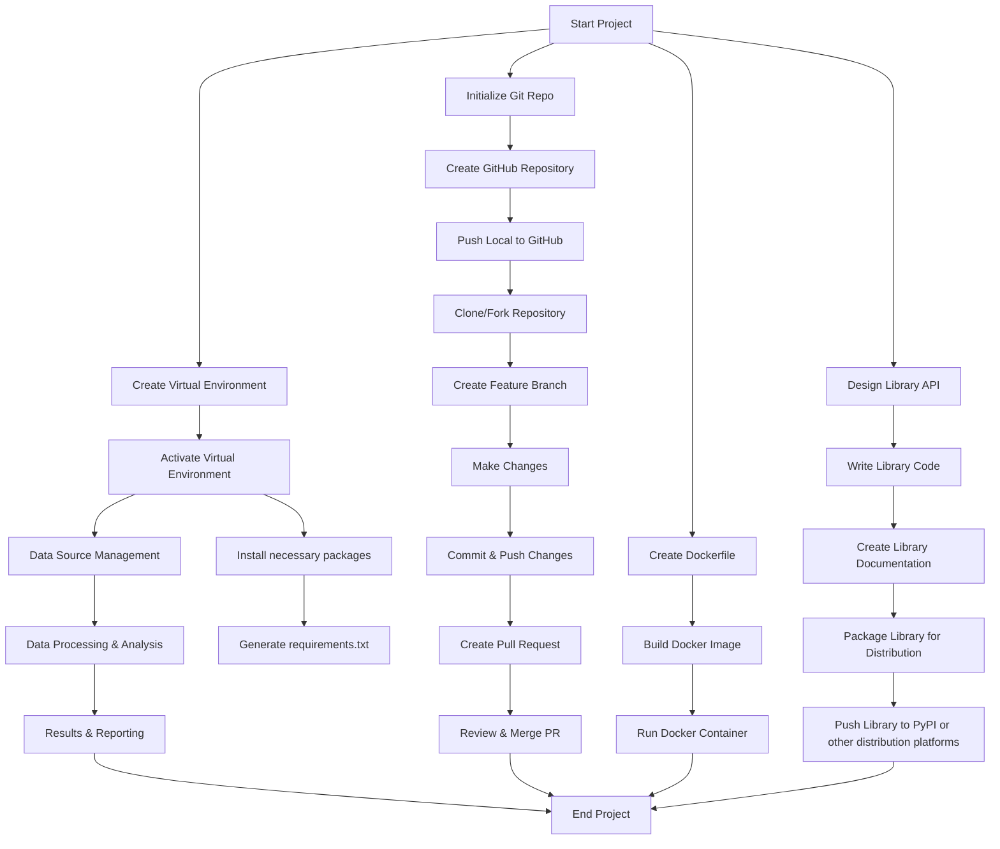

```mermaid


graph TD

A[Start Project]

%% Virtual Environments
A --> B[Create Virtual Environment]
B --> C[Activate Virtual Environment]

%% Guerrilla Analytics Principles
C --> D[Data Source Management]
D --> E[Data Processing & Analysis]
E --> F[Results & Reporting]

%% requirements.txt
C --> G[Install necessary packages]
G --> H[Generate requirements.txt]

%% GitHub Workflow
A --> I[Initialize Git Repo]
I --> J[Create GitHub Repository]
J --> K[Push Local to GitHub]

%% GitHub Collaboration
K --> L[Clone/Fork Repository]
L --> M[Create Feature Branch]
M --> N[Make Changes]
N --> O[Commit & Push Changes]
O --> P[Create Pull Request]
P --> Q[Review & Merge PR]

%% Docker
A --> R[Create Dockerfile]
R --> S[Build Docker Image]
S --> T[Run Docker Container]

%% Python Library Development
A --> V[Design Library API]
V --> W[Write Library Code]
W --> X[Create Library Documentation]
X --> Y[Package Library for Distribution]
Y --> Z[Push Library to PyPI or other distribution platforms]

%% End
F --> U[End Project]
Q --> U
T --> U
Z --> U

```
